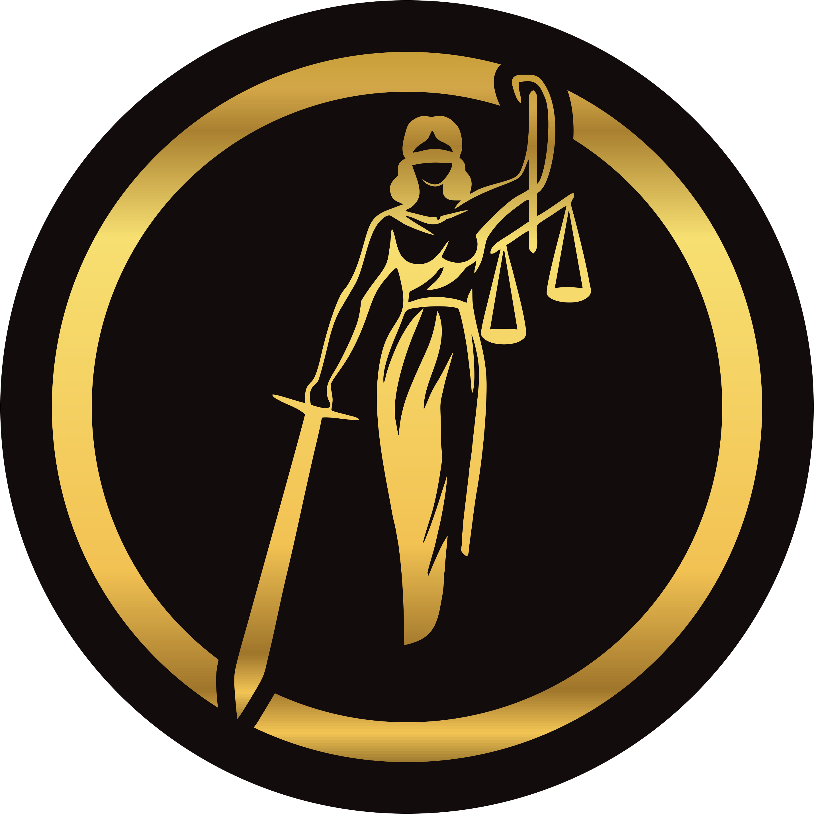

# HAAS Advocacia — Sistema de Design
> Autoridade jurídica em estética cinematográfica

**Cliente:** HAAS Advocacia
**Agência:** Almeida Escala Digital
**Tema:** dark
**Versão:** 1.0

A HAAS Advocacia é um escritório consolidado em três frentes — **Previdenciário** (Dra. Aline), **Trabalhista** (Dra. Heloísa) e **Civil e Família** (ambas). Sua presença digital precisa refletir a mesma autoridade que a marca ostenta no impresso: ouro metálico sobre preto profundo, capitais romanas, espaços generosos, gestos editoriais sóbrios.

Este sistema de design parte da logomarca oficial — "HAAS" em ouro metálico com o subtítulo "ADVOCACIA E CONSULTORIA JURÍDICA" em capitais romanas — e estende sua estética para todo o site: hero cinematográfico iniciado por vídeo 3D, paleta dominantemente preta, dourado pontual em destaques, branco editorial para texto e cards, tipografia serifa romana para títulos (Cinzel) e serifa Garamond para corpo (Cormorant Garamond).

A referência cultural declarada pelo cliente é o escritório [BNMA Advogados](https://bnmaadvogados.com.br/) — dark cinematográfico premium. O resultado deve transmitir tradição, autoridade, ética e excelência, sem a frieza dos sites de tecnologia e sem a generalidade dos templates de advocacia de mercado.

---

## Tokens — Cores

Paleta enxuta `black / gold / white`, com hierarquia explícita: o preto domina, o ouro é destaque cirúrgico, o branco é conteúdo e contraste. Nada além disso — exceto o verde funcional do WhatsApp.

| Nome | Hex | Token | Papel |
|---|---|---|---|
| Onyx | `#0A0A0A` | `--color-onyx` | Background dominante de página em seções neutras |
| Pure Black | `#000000` | `--color-pure-black` | Hero, footer, áreas de máximo peso visual |
| Charcoal | `#1A1A1A` | `--color-charcoal` | Superfícies elevadas (cards) sobre dark |
| Graphite | `#2A2A2A` | `--color-graphite` | Bordas sutis, separadores, divisores |
| Champagne Gold | `#C9A961` | `--color-gold` | **Cor de marca primária** — CTAs, fios, números, ícones, links de destaque |
| Burnished Gold | `#A78A4B` | `--color-gold-deep` | Hover/pressed/active de elementos gold |
| Light Gold | `#E5C77A` | `--color-gold-light` | Highlights tipográficos, ornamentos finos, destaques de texto |
| Paper White | `#FFFFFF` | `--color-paper-white` | Texto principal sobre dark, cards reversos |
| Warm Ivory | `#F5F1E8` | `--color-ivory` | Off-white quente para seções claras (parcimônia) |
| Stone | `#8A8A8A` | `--color-stone` | Texto secundário/muted, metadados, OAB |

### Gradiente metálico oficial

Para tratamento "ouro" em títulos hero e ornamentos especiais — simula a metalicidade da logo:

```css
--gradient-gold-metallic: linear-gradient(135deg, #E5C77A 0%, #C9A961 35%, #8C6E2B 60%, #C9A961 80%, #E5C77A 100%);
```

Aplicação típica em texto:

```css
.headline-gold {
  background: var(--gradient-gold-metallic);
  -webkit-background-clip: text;
          background-clip: text;
  color: transparent;
}
```

### Cor funcional (exceção)

| Nome | Hex | Token | Uso |
|---|---|---|---|
| WhatsApp Green | `#25D366` | `--color-whatsapp` | Única cor fora da paleta. Mantida por reconhecibilidade (FAB mobile, hover do ícone social). |

---

## Tokens — Tipografia

Três famílias, todas free via Google Fonts. Hierarquia clara: **Cinzel** para autoridade (display), **Cormorant Garamond** para leitura editorial (body), **Inter** para chrome técnico (nav, labels, OAB).

### Cinzel — Display · `--font-display`

Capitais romanas modernas, com a mesma personalidade arquitetônica do "ADVOCACIA E CONSULTORIA JURÍDICA" da logo. Usada em headlines, títulos de seção, eyebrows, botões.

- **Substituto fallback:** Trajan Pro, Times New Roman serif
- **Pesos:** 600, 700
- **Tamanhos:** 28px, 40px, 56px, 80px, 112px
- **Line height:** 0.95 (display) a 1.15 (heading-sm)
- **Letter spacing:** **+0.5px a +2px** em capitais — regra romana clássica, dá ar entre letras maiúsculas
- **Caixa:** sempre uppercase em headlines e botões; pode ser mixed-case em eyebrows pequenos

### Cormorant Garamond — Body · `--font-body`

Serifa Garamond renascentista, alto contraste de stroke, ideal para parágrafos editoriais longos. Confere ar de tradição sem perder legibilidade. Usada em textos corridos, citações, bios, descrições de áreas.

- **Substituto fallback:** EB Garamond, Georgia, serif
- **Pesos:** 400 (regular), 500 (medium), 600 (semibold), 400 italic, 500 italic
- **Tamanhos:** 16px, 18px, 20px, 24px
- **Line height:** 1.55 (body) a 1.4 (subheading)
- **Letter spacing:** 0 a -0.2px
- **Caixa:** sentence case
- **Italic:** usado em citações, frases-assinatura, mottos institucionais

### Inter — UI · `--font-ui`

Sans-serif neutra, **exclusivamente** para elementos de interface técnica: navegação, labels, OAB, metadados, captions, código eventual. **Nunca em conteúdo editorial.**

- **Substituto fallback:** ui-sans-serif, system-ui, -apple-system, "Segoe UI", Roboto
- **Pesos:** 400, 500
- **Tamanhos:** 12px, 14px
- **Line height:** 1.4 a 1.5
- **Letter spacing:** +1px em nav (tracking levemente positivo), 0 em labels

### Escala tipográfica

| Role | Família | Tamanho | Line Height | Letter Spacing | Token |
|---|---|---|---|---|---|
| caption | Inter 400 | 12px | 1.5 | +0.5px | `--text-caption` |
| ui-sm | Inter 500 | 14px | 1.4 | +1px | `--text-ui-sm` |
| body | Cormorant 400 | 18px | 1.55 | 0 | `--text-body` |
| body-lg | Cormorant 400 | 20px | 1.5 | 0 | `--text-body-lg` |
| quote | Cormorant 500 italic | 24px | 1.4 | -0.2px | `--text-quote` |
| heading-sm | Cinzel 600 | 28px | 1.15 | +1px | `--text-heading-sm` |
| heading | Cinzel 700 | 40px | 1.1 | +1.5px | `--text-heading` |
| heading-lg | Cinzel 700 | 56px | 1.05 | +1.5px | `--text-heading-lg` |
| display | Cinzel 700 | 80px | 1.0 | +2px | `--text-display` |
| display-xl | Cinzel 700 | 112px | 0.95 | +2px | `--text-display-xl` |

---

## Tokens — Spacing & Shapes

**Base unit:** 8px
**Density:** editorial (espaços generosos)

### Escala de espaçamento

| Token | Valor | Uso típico |
|---|---|---|
| `--spacing-8` | 8px | Padding micro, gap entre ícone e label |
| `--spacing-16` | 16px | Padding interno de pills, gap entre itens de lista |
| `--spacing-24` | 24px | Element gap padrão, padding de cards mobile |
| `--spacing-32` | 32px | Gap entre blocos relacionados, padding de cards desktop |
| `--spacing-48` | 48px | Gap entre blocos distintos dentro de uma seção |
| `--spacing-64` | 64px | Padding superior/inferior de cards grandes |
| `--spacing-80` | 80px | Section gap mobile |
| `--spacing-120` | 120px | Section gap desktop padrão |
| `--spacing-160` | 160px | Section gap reforçado para hero/CTA final |

### Border radius (reduzido)

Cantos quase retos comunicam tradição/autoridade — oposto ao "32px super-rounded" dos templates de produto AI.

| Token | Valor | Uso |
|---|---|---|
| `--radius-card` | 4px | Cards de serviço, blog, FAQ |
| `--radius-button` | 2px | Botões padrão |
| `--radius-pill` | 999px | CTAs principais, FAB WhatsApp, badges |
| `--radius-image` | 2px | Fotos das advogadas (cantos sutis) |

### Layout

- **Section gap:** 120px desktop · 80px mobile
- **Card padding:** 32px desktop · 24px mobile
- **Element gap:** 24px (base)
- **Page max-width:** 1280px (gutter 24px mobile, 48px desktop)
- **Container ledger:** páginas de leitura prolongada (blog post, biografia) → `max-width: 720px` centralizado, line-height 1.7.

---

## Tokens — Motion

Animações sóbrias, nunca exageradas. Easing cubic, durações entre 200ms e 1200ms.

| Token | Valor | Uso |
|---|---|---|
| `--ease-out-cubic` | `cubic-bezier(0.33, 1, 0.68, 1)` | Entradas, fade-ups, reveals |
| `--ease-in-out` | `cubic-bezier(0.65, 0, 0.35, 1)` | Hovers, transições de estado |
| `--duration-fast` | 200ms | Hovers, micro-feedback |
| `--duration-mid` | 400ms | Transições de seção, fade-up de cards |
| `--duration-slow` | 700ms | Reveals editoriais, entrada do hero |
| `--duration-cinematic` | 1200ms | Cinematic Intro Sequence (header descendo, hero fadeup) |

Respeitar **`prefers-reduced-motion: reduce`** em toda animação não-funcional — desliga transições e a Cinematic Intro Sequence.

---

## Cinematic Intro Sequence

**Comportamento de marca crítico — definido pelo cliente.** Toda primeira visita à home executa esta sequência. Não é decorativa; é a assinatura da HAAS.

### Desktop (≥1024px)

- Container full-bleed em preto puro (`#000`).
- Vídeo 3D ([`018 VÍDEO 3D/`](018%20VÍDEO%203D/)) toca em `autoplay muted playsinline` ocupando 100vw × 100vh com `object-fit: cover` — preenche a tela inteira; pode recortar bordas, prioridade é imersão.
- Botão **"Pular intro →"** em ghost gold:
  - `border: 1px solid var(--color-gold)`, texto Cinzel 12px tracking +2px, `padding: 12px 20px`.
  - Opacidade 60% no estado normal, 100% no hover.
  - Ancoragem: `position: fixed; bottom: 32px; right: 32px`.
  - `aria-label="Pular animação de introdução"`, `tabindex="0"`, ativável por Enter/Space.

### Mobile (<1024px)

- Container full-bleed em preto puro, com `display: flex; align-items: center; justify-content: center`.
- Vídeo **continua tocando** — não substituir por imagem estática. É a entrada da marca da HAAS.
- Dimensionamento: vídeo **centralizado verticalmente**, `width: 100vw` (bordas verticais do vídeo encostam nas bordas verticais da tela do celular), `height: auto`, `max-height: 100vh`, `object-fit: contain`. Áreas acima e abaixo ficam **letterboxed em preto** — preserva o frame 3D original sem corte lateral em telas portrait estreitas.

CSS de referência:

```css
.intro-stage {
  position: fixed;
  inset: 0;
  background: #000;
  display: flex;
  align-items: center;
  justify-content: center;
  z-index: 100;
}
.intro-video {
  width: 100vw;
  height: auto;
  max-height: 100vh;
  object-fit: contain;
}
```

- Skip button em **versão minimalista**:
  - Sem border, apenas texto `Pular →` em Cinzel 11px tracking +2px.
  - Cor `--color-gold` com opacidade 70%.
  - Ancoragem: `position: fixed; bottom: 20px; right: 20px`.
  - **Hit area ≥44×44px** garantida via `padding: 12px 8px` (invisível, WCAG 2.5.5 / Apple HIG).
  - Sem hover (mobile não tem hover) — apenas `:active { opacity: 1; }`.

### Transição final (desktop e mobile, idêntica)

Ao terminar o vídeo (evento `ended`) **ou** ao clicar/tocar no skip:

1. **Freeze** — `<video>` é congelado no último frame:
   - Em `onended`: `video.pause()`.
   - No skip: `video.currentTime = video.duration; video.pause();`.
   - O vídeo permanece visível como background do hero, com `filter: brightness(0.55)` para garantir contraste do texto sobreposto.
   - No mobile, o letterboxing preto permanece e vira parte da estética dark.
2. **Header desce** — logo + nav + CTA entram do topo:
   - `transform: translateY(-100%) → translateY(0)`, `opacity: 0 → 1`.
   - `duration: 600ms`, `ease-out-cubic`.
   - Stagger de **80ms** entre logo, links e CTA.
3. **Hero fade-up** (em paralelo, delay 200ms relativo ao header):
   - Eyebrow Cinzel → headline gold → subtítulo Cormorant → par de CTAs.
   - `translateY(24px) → 0`, `opacity: 0 → 1`.
   - `duration: 700ms`, `ease-out-cubic`.
4. **Skip desaparece** — `opacity → 0`, `pointer-events: none`.

### Gate "primeiro visit"

- Após a sequência terminar com sucesso: `sessionStorage.setItem('haas_intro_seen', '1')`.
- Em qualquer carregamento posterior na mesma sessão (navegação interna → home): se a chave existir, **pular** direto para o estado final — último frame como background + header e hero já visíveis, sem animação. Evita repetir a intro a cada visita à home na mesma sessão.

### Acessibilidade

- `prefers-reduced-motion: reduce` → pular toda a sequência. Mostrar estado final imediatamente (header e hero visíveis, vídeo pausado no último frame ou imagem estática como fallback).
- Skip button **focável via teclado**: `tabindex="0"`, `aria-label="Pular animação de introdução"`, ativável por Enter ou Space.
- Texto do skip nunca apenas seta (`→`) — sempre acompanhado da palavra "Pular".

### Performance

O MP4 atual tem 14.4MB. Como o vídeo agora toca em desktop **e** mobile, mitigar o peso em mobile:

- **Variante mobile-optimized do vídeo** (a gerar a partir do original): mesmo conteúdo em resolução menor (ex.: 720p portrait-cropped) e bitrate reduzido. Alvo: <4MB.
- Servir com `<source media="(max-width: 1023px)" src="assets/video/intro-mobile.mp4">` (leve) e `<source src="assets/video/intro-desktop.mp4">` (full desktop).
- `preload="auto"` em ambos.
- Aguardar evento `canplaythrough` antes de iniciar a sequência (evita travadas).
- **Indicador de loading** sutil enquanto carrega: palavra "HAAS" em Cinzel 700 60px, `--color-gold-light` opacidade 40%, animação `opacity` infinito 1.6s ease-in-out. Remove no `play` do vídeo.

---

## Components

Componentes alinhados com o brief HAAS (Home, Sobre, Serviços, Páginas de Autoridade, Blog, FAQ, Footer) e com a stack zero-Node (HTML5 + Tailwind v4 CDN + Vanilla JS + GSAP). Descrições focam em tokens — não código pronto.

### Header / Nav

- Barra fixa no topo, preta translúcida (`backdrop-filter: blur(16px); background: rgba(0,0,0,0.7)`).
- Após scroll > 80px: vira sólida (`background: #000`).
- Logo gold à esquerda — usar [`LOGO TRS.png`](01%20LOGOMARCA%20NORMAL/LOGO%20TRS.png) (transparente), altura 48px desktop / 40px mobile.
- Links de navegação: Cinzel 14px tracking +1px, `--color-paper-white` normal, `--color-gold` no hover/active.
- CTA "Agendar Consulta" em **pill gold** à direita (variante `gold-solid`).
- **Estado inicial** controlado pela Cinematic Intro Sequence — `translateY(-100%); opacity: 0` até a animação disparar.
- Mobile: menu hamburger gold → drawer overlay preto com links empilhados Cinzel 24px.

### Hero

- Background = **último frame do vídeo 3D congelado** (`filter: brightness(0.55)`).
  - Desktop: `object-fit: cover` full-bleed.
  - Mobile: vídeo centralizado com letterboxing preto vertical (igual à intro).
- Conteúdo:
  - Eyebrow Cinzel 12px tracking +2px gold ("HAAS ADVOCACIA E CONSULTORIA JURÍDICA")
  - Headline Cinzel 700 80–112px com gradient gold metálico (ex.: "Excelência jurídica que protege a sua história")
  - Subtítulo Cormorant 400 italic 24px branco
  - Par de CTAs: primário `gold-solid` "Agendar Consulta" + secundário `white-ghost` "Conheça o escritório"
- Section padding: 160px topo / 120px base desktop.

### Card de Serviço (Área de Atuação)

- Fundo `--color-charcoal`, fio gold superior 1px (`border-top: 1px solid var(--color-gold)`).
- Padding 32px desktop / 24px mobile, `border-radius: var(--radius-card)`.
- Estrutura vertical:
  - Ícone gold no topo (reaproveitar dos [`017 ÍCONES DESTAQUES INSTAGRAM/`](017%20%C3%8DCONES%20DESTAQUES%20INSTAGRAM/), mapeado por área)
  - Título Cinzel 28px branco
  - Especialista por trás do título: Cormorant italic 16px stone ("por Dra. Aline")
  - Descrição Cormorant 18px stone (3–4 linhas)
  - Lista das 3 sub-áreas mais importantes em Cinzel 14px tracking +1px gold (com `→` final)
  - Link "Saiba mais →" gold ao final
- **Hover**: fio engrossa para 2px, gold escurece para `--color-gold-deep`, `translateY(-4px)` sutil.
- Card inteiro é `<a>` para a página de autoridade da área.

### Página de Autoridade (template repetível por área)

Cada área leva a uma página dedicada com a especialista. Layout two-column ≥1024px, stacked <1024px:

- **Coluna esquerda (40%):**
  - Foto profissional da advogada dentro de uma das [`011 MOLDURA/`](011%20MOLDURA/) (escolher uma como padrão visual fixo do site).
  - Nome em Cinzel 40px branco.
  - OAB em Inter 12px stone abaixo.
  - WhatsApp pill `gold-solid` direto para a advogada.
- **Coluna direita (60%):**
  - Eyebrow gold "ÁREA DE ATUAÇÃO"
  - Headline Cinzel 56px gold ("Direito Previdenciário")
  - Bio Cormorant 18px (4–6 parágrafos)
  - Subtítulo Cinzel 28px branco "Como podemos ajudar"
  - Lista de sub-áreas em `<dl>` — termo Cinzel 18px gold + definição Cormorant 16px stone.

### Sobre Nós (2 blocos)

Estrutura obrigatória conforme brief:

1. **Bloco institucional** — texto Cormorant 20px sobre fundo onyx, headline Cinzel 56px, citação assinatura Cormorant 500 italic 24px com indicador gold à esquerda (`border-left: 2px solid var(--color-gold)`).
2. **Bloco de Profissionais** — grid 2-col (Dra. Aline | Dra. Heloísa):
   - Foto dentro da moldura gold escolhida.
   - Nome Cinzel 32px branco.
   - OAB Inter 12px stone.
   - Especialidade Cormorant italic 18px gold.
   - Bio resumida Cormorant 16px (5–7 linhas).
   - CTA "Ver currículo completo →" para a página de autoridade.

### Blog

- Grid 3 colunas desktop / 1 coluna mobile.
- Card charcoal com fio gold inferior, padding 24px.
- Data Inter 12px tracking +1px gold.
- Título Cinzel 22px branco (`line-clamp: 3`).
- Resumo Cormorant 16px stone (`line-clamp: 4`).
- Link "Ler artigo →" gold.
- Página do post: container ledger (`max-width: 720px`), título Cinzel 56px, corpo Cormorant 20px com `line-height: 1.7`.

### FAQ

- `<details>` HTML nativo, sem JS necessário.
- Cada item: pergunta Cinzel 18px branco, resposta Cormorant 18px stone.
- Separadores gold 1px entre itens.
- Ícone `+` gold que vira `−` quando aberto (CSS-only via `[open] .icon`).

### Localização

- Endereço Cinzel 20px gold + Cormorant 16px stone.
- Horário de atendimento em pill outlined gold.
- Iframe Google Maps com `loading="lazy"`, `border-radius: 4px`, altura 400px.
- Botão "Ver Rotas →" `gold-solid` para `https://www.google.com/maps/dir/?api=1&destination=<endereço>`.

### CTA Final

- Bloco full-bleed preto puro, section padding 160px.
- Headline Cinzel 80px com gradient gold metálico ("Sua causa merece a melhor defesa.")
- Subtítulo Cormorant 24px italic branco.
- Par de CTAs centralizados: WhatsApp `gold-solid` + telefone `white-ghost`.

### Footer

- Fundo preto puro, padding 120px topo / 64px base.
- Logo full [`LOGO.png`](01%20LOGOMARCA%20NORMAL/LOGO.png) centralizada (`max-width: 280px`).
- Grid 3 colunas: Navegação | Contato | Redes Sociais.
- Cada coluna: título Cinzel 14px tracking +2px gold + links Cormorant 16px paper-white (hover gold).
- Redes sociais: ícones gold via mask CSS, hover na cor original da rede (regra `landing-patterns.md` §5). Incluir Jusbrasil como rede de nicho jurídico.
- Linha divisória gold 1px no rodapé final.
- Copyright Inter 12px stone à esquerda + crédito **"Site desenvolvido por Almeida Escala Digital"** em Inter 12px gold (hover white) à direita — `https://almeidaescaladigital.com/`, `target="_blank" rel="noopener"`.

### Botões — variantes

| Variante | Background | Texto | Border | Hover |
|---|---|---|---|---|
| `gold-solid` | `--color-gold` | `--color-pure-black` Cinzel 14 +1 | none | bg `--color-gold-deep` |
| `gold-ghost` | transparent | `--color-gold` Cinzel 14 +1 | 1px `--color-gold` | bg gold 10%, texto `--color-gold-light` |
| `white-ghost` | transparent | `--color-paper-white` Cinzel 14 +1 | 1px `--color-paper-white` | bg white 10% |
| `whatsapp-fab` (mobile) | `--color-whatsapp` | branco (ícone) | none | `filter: brightness(1.1)` |

CTAs primários: `border-radius: var(--radius-pill)`. Botões secundários inline: `var(--radius-button)`.

### Mobile-only

- **FAB WhatsApp**: redondo `#25D366`, 56×56px, `position: fixed; bottom: 96px; right: 16px` (acima da sticky bar).
- **Sticky CTA bar**: barra branca fixa no rodapé com pill `gold-solid` "Agendar Consulta" linkando WhatsApp.
- Ambos somem em `≥ md` (768px).
- Aparecem quando scroll passa de ~55% da hero; somem ao voltar ao topo (GSAP ScrollTrigger).

---

## Inventário de Assets

As pastas entregues pelo cliente são organizadas por uso no site:

| Pasta | Conteúdo | Uso no site |
|---|---|---|
| [`01 LOGOMARCA NORMAL/`](01%20LOGOMARCA%20NORMAL/) | `LOGO.png` (gold-on-black full), `LOGO TRS.png` (transparente), `LOGO PRETO.png` (preto sólido), versões CMYK/PDF/CDR (print) | **Header** → `LOGO TRS.png` (sobre vídeo/blur). **Footer & ornamento hero** → `LOGO.png`. **Fundos brancos** → `LOGO PRETO.png`. PDF/CDR reservados para impressão. |
| [`011 MOLDURA/`](011%20MOLDURA/) | 3 designs de moldura ornamental gold | **Frames das fotos das advogadas** — Sobre Nós (perfis) e Páginas de Autoridade. Escolher uma das 3 como padrão visual fixo do site para coerência. |
| [`015 FAVICON SITE/`](015%20FAVICON%20SITE/) | `FAV.png` + `FAV.cdr` | **`<link rel="icon">`** no `<head>`. No projeto, copiar para `assets/favicon.png` e gerar `favicon.ico` 32×32. |
| [`017 ÍCONES DESTAQUES INSTAGRAM/`](017%20%C3%8DCONES%20DESTAQUES%20INSTAGRAM/) | 7 ícones gold (ADVOGANDO, DÚVIDAS, FAMILIA, INSTITUCIONAL, JUSTIÇA, LIVROS, ROTINA) | **Ícones funcionais do site**, mantendo coerência com Instagram. Mapeamento: `JUSTIÇA → Previdenciário (Aline)` · `ADVOGANDO → Trabalhista (Heloísa)` · `FAMILIA → Civil e Família` · `INSTITUCIONAL → Sobre Nós` · `LIVROS → Blog` · `DÚVIDAS → FAQ` · `ROTINA → fallback / Localização`. |
| [`018 VÍDEO 3D/`](018%20V%C3%8DDEO%203D/) | MP4 14.4MB | **Cinematic Intro Sequence** — entrada cinematográfica no primeiro visit. Background do hero (último frame congelado). Gerar variante mobile <4MB. Ver spec completa em "Cinematic Intro Sequence". |
| [`022 CARTÃO DIGITAL/`](022%20CART%C3%83O%20DIGITAL/) | Cartão (CDR + PDF) + `DADOS.txt` | **Fonte de verdade dos contatos** — consumir `DADOS.txt` para preencher: telefone, e-mail, endereço, OAB das advogadas, redes sociais. Footer, Localização, WhatsApp deep-links. |

**Recomendação para o build do site** (não alterar as pastas originais):

- Criar dentro do repositório do site uma estrutura `assets/images/` com cópias renomeadas dos PNGs essenciais — `logo-full.png`, `logo-transparent.png`, `logo-black.png`, `favicon.png`, `moldura.png`, `icone-previdenciario.png`, `icone-trabalhista.png`, `icone-civil-familia.png`, etc.
- As pastas originais (`01 LOGOMARCA NORMAL/`, etc.) ficam intactas como arquivo de marca/print.
- Vídeo: `assets/video/intro-desktop.mp4` (cópia do original) e `assets/video/intro-mobile.mp4` (variante leve gerada).

---

## Do's & Don'ts

### Do

- **Dourado como destaque pontual** — CTAs, fios, números, ícones, links de ênfase. Nunca como background de área grande (gold em massa "queima" o efeito metálico).
- **Cinzel em capitais com tracking positivo** (+1px a +2px) — regra romana clássica, dá ar entre letras maiúsculas e melhora leitura.
- **Preto puro nas áreas de máximo peso** (hero, footer, CTA final); onyx/charcoal nas áreas internas para criar profundidade sutil sem perder o dark.
- **Cormorant italic para citações e mottos** — palavras como "excelência", "ética", "trajetória", "tradição" ganham assinatura editorial.
- **Reaproveitar ícones gold do Instagram** nas áreas de atuação e seções — coerência visual entre site e social.
- **WhatsApp como conversão primária** — verde brand-original `#25D366`, não traduzir para gold (reconhecibilidade > coerência cromática).
- **Logo em destaque maior** que padrões genéricos — pedido explícito do cliente. Header com altura 48px+, footer com largura 280px+.
- **Respiro generoso entre seções** — 120px desktop / 80px mobile. Advocacia premium não comprime conteúdo.
- **Respeitar `prefers-reduced-motion`** em toda animação, especialmente a Cinematic Intro Sequence.
- **Hit area mínima 44×44px** em todo elemento interativo — especialmente no skip mobile.

### Don't

- **Não usar gradientes coloridos, neon, ou cores fora de black/gold/white/stone.** Verde do WhatsApp é a única exceção funcional.
- **Não usar sans-serif (Inter) em headings ou parágrafos editoriais.** Inter é exclusiva de nav, labels técnicos, OAB.
- **Não usar border-radius ≥16px.** Quebra a vibe de autoridade clássica. Cards 4px, botões 2px, pills 999px — nada entre.
- **Não usar a logo abaixo de 120px de largura.** Perde o detalhe do efeito gold metálico; usar apenas o favicon ou monograma "H" nesses tamanhos.
- **Não usar `LOGO.png` (gold-on-black) sobre fundos coloridos ou brancos.** Para fundos brancos existe `LOGO PRETO.png`. Para fundos com vídeo/blur existe `LOGO TRS.png`.
- **Não inventar variações de dourado.** Só `--color-gold`, `--color-gold-deep`, `--color-gold-light`. Tons "decorativos" extras matam coerência da marca.
- **Não usar sombras suaves para elevação.** Cards são planos; profundidade vem do contraste de cor (charcoal sobre onyx). Box-shadow só em FAB mobile e modais.
- **Não usar imagens stock genéricas** ("equipe profissional sorrindo em sala de reunião"). Só fotos reais das advogadas, do escritório, ou do vídeo 3D.
- **Não esconder contatos atrás de formulário.** WhatsApp/telefone/e-mail sempre clicáveis e visíveis.
- **Não repetir a Cinematic Intro a cada navegação interna.** Gate `sessionStorage` é obrigatório.

---

## Imagery

- **Fotografia primária**: retratos profissionais das advogadas em ambiente do escritório, iluminação contrastada, fundo escuro ou neutro. Sempre dentro das molduras gold de [`011 MOLDURA/`](011%20MOLDURA/).
- **Elemento 3D**: vídeo da intro (ver Cinematic Intro Sequence) — único uso de motion graphics no site.
- **Ornamentos**: fios gold 1px horizontais ou verticais como separadores; ícones gold do Instagram como guias semânticos.
- **Não usar**: stock photography, ilustrações coloridas, mockups de UI fictícia, fotos de balanças/martelos clichês de advocacia.
- **Imagens informativas** com `alt` descritivo em PT-BR; decorativas com `aria-hidden="true"`.

---

## Layout

- Página com `max-width: 1280px` centralizada, gutter 48px desktop / 24px mobile.
- Hero e Footer **full-bleed** (sem max-width) para imersão.
- Seções com **120px** de gap vertical desktop, **80px** mobile.
- Hierarquia padrão de seção: eyebrow Cinzel 12px tracking +2px gold → headline Cinzel 56px → corpo Cormorant 20px.
- Grid: 12 colunas desktop, 4 colunas mobile, gutter 24px.
- Páginas de leitura prolongada (blog post, biografia longa) usam **container ledger** `max-width: 720px` centralizado, line-height 1.7, ar máximo.

---

## Quick Start

### Google Fonts — import

No `<head>` do HTML, antes do `<style>` do tema:

```html
<link rel="preconnect" href="https://fonts.googleapis.com">
<link rel="preconnect" href="https://fonts.gstatic.com" crossorigin>
<link href="https://fonts.googleapis.com/css2?family=Cinzel:wght@600;700&family=Cormorant+Garamond:ital,wght@0,400;0,500;0,600;1,400;1,500&family=Inter:wght@400;500&display=swap" rel="stylesheet">
```

### CSS Custom Properties

```css
:root {
  /* Colors */
  --color-onyx: #0A0A0A;
  --color-pure-black: #000000;
  --color-charcoal: #1A1A1A;
  --color-graphite: #2A2A2A;
  --color-gold: #C9A961;
  --color-gold-deep: #A78A4B;
  --color-gold-light: #E5C77A;
  --color-paper-white: #FFFFFF;
  --color-ivory: #F5F1E8;
  --color-stone: #8A8A8A;
  --color-whatsapp: #25D366;

  /* Gradient */
  --gradient-gold-metallic: linear-gradient(135deg, #E5C77A 0%, #C9A961 35%, #8C6E2B 60%, #C9A961 80%, #E5C77A 100%);

  /* Typography — Families */
  --font-display: 'Cinzel', 'Trajan Pro', 'Times New Roman', serif;
  --font-body: 'Cormorant Garamond', 'EB Garamond', Georgia, serif;
  --font-ui: 'Inter', ui-sans-serif, system-ui, -apple-system, BlinkMacSystemFont, "Segoe UI", Roboto, sans-serif;

  /* Typography — Scale */
  --text-caption: 12px;
  --text-ui-sm: 14px;
  --text-body: 18px;
  --text-body-lg: 20px;
  --text-quote: 24px;
  --text-heading-sm: 28px;
  --text-heading: 40px;
  --text-heading-lg: 56px;
  --text-display: 80px;
  --text-display-xl: 112px;

  /* Typography — Line Heights */
  --leading-caption: 1.5;
  --leading-ui-sm: 1.4;
  --leading-body: 1.55;
  --leading-body-lg: 1.5;
  --leading-quote: 1.4;
  --leading-heading-sm: 1.15;
  --leading-heading: 1.1;
  --leading-heading-lg: 1.05;
  --leading-display: 1.0;
  --leading-display-xl: 0.95;

  /* Typography — Letter Spacing */
  --tracking-caption: 0.5px;
  --tracking-ui-sm: 1px;
  --tracking-heading: 1.5px;
  --tracking-display: 2px;

  /* Typography — Weights */
  --font-weight-regular: 400;
  --font-weight-medium: 500;
  --font-weight-semibold: 600;
  --font-weight-bold: 700;

  /* Spacing */
  --spacing-8: 8px;
  --spacing-16: 16px;
  --spacing-24: 24px;
  --spacing-32: 32px;
  --spacing-48: 48px;
  --spacing-64: 64px;
  --spacing-80: 80px;
  --spacing-120: 120px;
  --spacing-160: 160px;

  /* Layout */
  --section-gap: 120px;
  --section-gap-mobile: 80px;
  --card-padding: 32px;
  --card-padding-mobile: 24px;
  --element-gap: 24px;
  --page-max-width: 1280px;
  --ledger-max-width: 720px;

  /* Border Radius */
  --radius-card: 4px;
  --radius-button: 2px;
  --radius-pill: 999px;
  --radius-image: 2px;

  /* Motion */
  --ease-out-cubic: cubic-bezier(0.33, 1, 0.68, 1);
  --ease-in-out: cubic-bezier(0.65, 0, 0.35, 1);
  --duration-fast: 200ms;
  --duration-mid: 400ms;
  --duration-slow: 700ms;
  --duration-cinematic: 1200ms;
}

@media (prefers-reduced-motion: reduce) {
  *, *::before, *::after {
    animation-duration: 0.01ms !important;
    animation-iteration-count: 1 !important;
    transition-duration: 0.01ms !important;
  }
}
```

### Tailwind v4 — @theme

Para uso com Tailwind v4 via CDN (`<script src="https://cdn.tailwindcss.com"></script>`), incluir o bloco em `<style type="text/tailwindcss">`:

```css
@theme {
  /* Colors */
  --color-onyx: #0A0A0A;
  --color-pure-black: #000000;
  --color-charcoal: #1A1A1A;
  --color-graphite: #2A2A2A;
  --color-gold: #C9A961;
  --color-gold-deep: #A78A4B;
  --color-gold-light: #E5C77A;
  --color-paper-white: #FFFFFF;
  --color-ivory: #F5F1E8;
  --color-stone: #8A8A8A;
  --color-whatsapp: #25D366;

  /* Typography */
  --font-display: 'Cinzel', 'Trajan Pro', 'Times New Roman', serif;
  --font-body: 'Cormorant Garamond', 'EB Garamond', Georgia, serif;
  --font-ui: 'Inter', ui-sans-serif, system-ui, sans-serif;

  /* Spacing — adiciona tokens custom além do padrão */
  --spacing-120: 120px;
  --spacing-160: 160px;

  /* Border Radius */
  --radius-card: 4px;
  --radius-button: 2px;
  --radius-pill: 999px;
}
```

### Exemplos de uso

```html
<!-- Headline com gradient gold metálico -->
<h1 class="font-display text-[80px] leading-none tracking-wider uppercase"
    style="background: var(--gradient-gold-metallic); -webkit-background-clip: text; color: transparent;">
  Excelência jurídica
</h1>

<!-- CTA primário -->
<a href="https://wa.me/55..." class="bg-gold text-pure-black font-display rounded-pill px-8 py-4 tracking-wider uppercase text-sm">
  Agendar Consulta
</a>

<!-- Parágrafo editorial -->
<p class="font-body text-[20px] leading-relaxed text-paper-white">
  Direito previdenciário e trabalhista com a precisão que sua história merece.
</p>

<!-- Card de área de atuação -->
<article class="bg-charcoal border-t border-gold rounded-card p-8 transition hover:-translate-y-1">
  
  <h3 class="font-display text-[28px] text-paper-white uppercase tracking-wide">Previdenciário</h3>
  <p class="font-body italic text-[16px] text-stone mt-2">por Dra. Aline</p>
  <p class="font-body text-[18px] text-stone mt-4">Aposentadorias, revisões, planejamento e defesas contra o INSS com o rigor técnico que cada benefício exige.</p>
  <a href="servicos/previdenciario.html" class="font-display text-gold text-sm tracking-wide uppercase mt-6 inline-block">Saiba mais →</a>
</article>
```

---

## Marcas similares (referência cultural)

- **[BNMA Advogados](https://bnmaadvogados.com.br/)** — referência explícita do cliente. Identidade dark + gold + white com vibe cinematográfica premium. Pontos a herdar: hero contemplativo, áreas de atuação em cards minimalistas, tom institucional sóbrio.
- **Cescon Barrieu Advogados** — escritório premium brasileiro com tipografia serifa, identidade institucional contida, navegação cristalina.
- **Mattos Filho** — referência de gestão de marca jurídica em larga escala; uso comedido de cor, tipografia em destaque, layouts editoriais.
- **Demarest Advogados** — uso minimalista de gold sobre preto, fotografia profissional sóbria, hierarquia editorial nítida.

> Inspiração ≠ imitação. A HAAS precisa de personalidade própria — gold metálico mais saturado, intro cinematográfica com vídeo 3D, e ícones gold do Instagram trazendo coerência cross-channel são diferenciais que nenhum dos referenciais explora.
